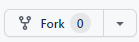
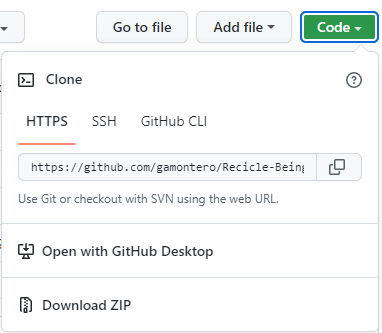
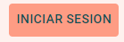
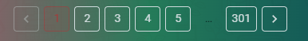
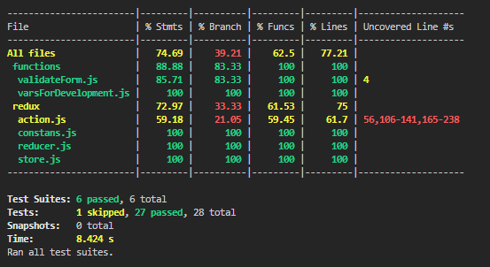
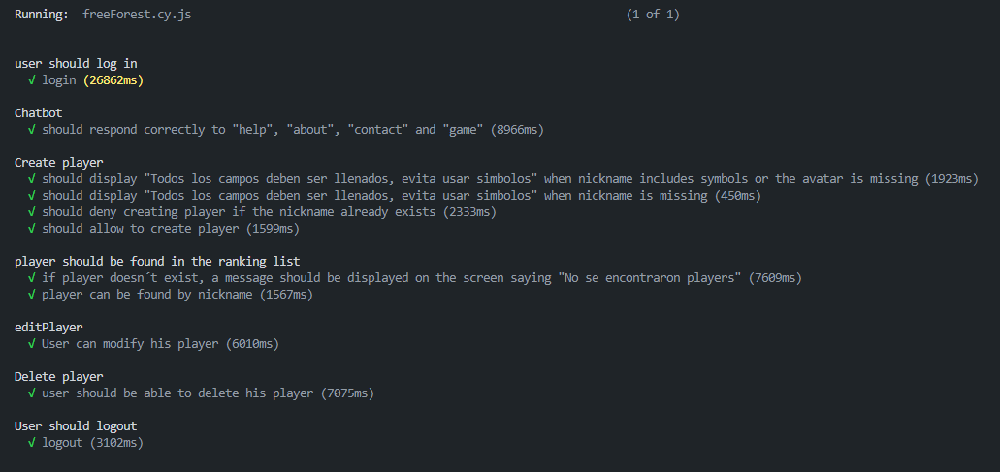

d<br>
<br>
<div align="center">


</div>

<p align="justify"> Free Forest es un proyecto grupal que se desarrolló como prueba técnica de la empresa Creditú. El principal requisito a cumplir fue la puesta en escena de un dashboard de consulta de puntos en una aplicación web de un juego hipotético, el cuál también tuvimos que desarrollar conceptualmente y está basado en la concientización del medio ambiente, enfocándonos con profundidad en la forestación, la cual te invitamos a visitarla en el siguiente enlace. </p>  

https://delosandes.xyz/

<br>
<br>
<h1> Primeros pasos 🚀 </h1>

Con las siguientes instrucciones podrás poner en funcionamiento nuestro proyecto localmente .

**📑    Requerimientos**

Para poder poner a correr esta aplicación tendrás que tener instalado en tu ordenador con anterioridad la última versión de NPM y Node, puedes chequear en consola si la tienes instalada haciendo 

```
npm -v
```
ó también

``` 
node-v
```

Sino en el siguiente link puedes descargarla gratuitamente - <https://nodejs.org/es/download/> .

Luego, deberás ingresar a nuestro repositorio de GitHub:
https://github.com/delosandesdevs/frontCreditu

Copia el repositorio haciendo click en Fork, así obtendrás una copia del mismo en tu Github.

<div align="center">



</div>

A continuación haz click en Code, copiando el link del repositorio para clonarlo localmente mediante gitBash o puedes descargar el Zip para luego descomprimirlo en tu computadora.

<div align="center">



</div>

<br>
<br>
<h1>Para instalar 🛠 </h1>

Llegó el momento para instalar nuestro proyecto en tu ordenador.

Abre la consola de tu editor y ejecuta los siguientes comandos.

```
npm install
```

Con este comando descargamos e instalamos todas las dependencias que utilizamos en el proyecto de forma automática. El tiempo de este proceso depende de tu conexión a internet y del poder del procesamiento de tu ordenador, ten paciencia, puede tardar unos minutos.

Luego, para iniciar la aplicación en tu navegador deberás ejecutar la siguiente línea de código en consola:

```
npm start
```

Este comando busca y ejecuta los scripts contenidos en el archivo que se denomina package.json, automáticamente desplegará la aplicación en su navegador predeterminado por el sistema en la dirección [http://localhost:3000](http://localhost:3000/) , este proceso puede demorar unos minutos.

Puedes realizar cambios en el código, y al ser guardados notarás que tu navegador se refrescará con los mismos.

<br>
<br>
<h1>Ahora a navegar 🏄</h1>

- **Home**

Al iniciar la aplicación web te encontrarás con los 10 mejores jugadores de Free Forest.

<div align="center">


</div>

En la barra de navegación encontrarás el botón “INICIAR SESIÓN” , allí se abrirá una ventana de autenticación, la que recomendamos que completes, así podrás acceder a todas las funcionalidades de la app.

<div align="center">



</div>

- **Ranking**

En la pestaña Ranking encontrarás a los jugadores de Free Forest ordenados por posiciones inicialmente. Nosotros te invitamos a que busques jugadores por su nombre, o su status en el juego.

<div align="center">


</div>

También puede buscar página por página los resultados.

<div align="center">



</div>

- **Acerca de**

En esta pestaña encontrarás toda la información del juego y los nombres de los desarrolladores.

- **Perfil**

Si tocas tu avatar en la parte superior a la derecha, podrás encontrar el enlace hacia tu perfil en Free Forest, el cual si no tienes un jugador te invita a crearlo, y si lo tienes mostrará tu progreso en el juego.

<br>
<br>
<h1>Testeando app 🕵</h1>

- **Pruebas unitarias**

Mediante Jest, MSW y algunas otras dependencias, hemos realizado tests unitarios de los componentes de la aplicación, funciones y configuraciones, chequeando el correcto funcionamiento y entendiendo cuál es la cobertura del testing sobre el código (utilizando Coverage), informe el cuál dejamos aquí debajo:


Para correr los tests unitarios, basta con correr el comando 
```
npm test
```
 en consola, el cuál ejecutará todos los tests ubicados en /src/tests

- **Pruebas end-to-end**

Mediante Cypress realizamos las pruebas end to end emulando la experiencia real del usuario sobre la aplicación, en este caso en el role de Admin. Se hizo énfasis sobre las funcionalidades criticas ya que entendemos el costo de tiempo que implica la ejecución de estos test. Debajo se puede encontrar el informe obtenido a través de la dashboard de cypress:


Se agrega el siguiente Gif como demo:


Para correr cypress primero se debe ejecutar 
```
npm start
```
para luego desde otra consola insertar el comando 
```
npm run cypress
```
 Ambos desde /frontCreditu. Tanto las pruebas unitarias como e2e han sido incorporadas a nustro equipo en este último tiempo, por lo que entendemos que hay puntos que pueden mejorarse y en los que seguiremos trabajando. 
<br>
<br>
<h1> Imagen Docker 🐙 </h1>
La imagen Docker de este proyecto es solamente del desarrollo frontend tomando todas las funcionalidades del back desde el deploy original.
Para poder manipular nuestra imagen Docker como principal requisito es tener instalado en tu ordenador Docker, el cual en el siguiente enlace puedes obtener el paso a paso para la instalación. 

https://www.docker.com/products/docker-desktop/ 

Luego ingresa en la terminal de tu ordenador e ingresa el siguiente comando para poder descargar la imagen.

```
docker pull gianfrancogobbi/freeforest_subido:latest
```

Cuando termine el proceso de descarga ya puedes correr tu imagen con el siguiente comando

```
docker run -it -p 3000:3000 gianfrancogobbi/freeforest_subido:latest
```
Ya con todos estos pasos, solamente queda ingresar a Free Forest a navegar en el siguiente enlace.

http://localhost:3000/

<br>
<br>
<h1>Tecnologías utilizadas 👨‍💻</h1>

- Para la comunicación en el trabajo en equipo utilizamos Trello
<br>(Front: https://trello.com/invite/b/r3u2sWyL/3fceca89fb9fbd54bf9ecdf6a2ddbb76/front-end
<br>Back: https://trello.com/b/AthDicAp/back-end
), Meet y grupo de Whatsapp, aplicando la metodología SCRUM.
- Para investigación UX y desarrollo conceptual del juego utilizamos Google Forms.
- Para unificar investigación, desarrollo UX , mockups de baja y alta fidelidad utilizamos Figma.
- Para desarrollo de aplicación utilizamos React, Javascript, Node, Redux, Express, Css, Material UI, React Persist y AWS.
- Para crear una imagen del proyecto utilizamos Docker.

-   Para Testing usamos
    - Cypress
    - Jest
    - Mock Service Worker (MSW)
    - Clarity ( Test de Usabilidad )

<br>
<br>
<h1>Equipo de desarrollo 🌄</h1>

<div style="display:flex; align-items:center; width: 100%">
<div >

- [Florencia Taburelli](<https://github.com/orgs/delosandesdevs/people/FlorenciaTaburelli>)

</div>

<div style="width:100px">


</div>

<div >

- [Juano Cataldo](<https://github.com/orgs/delosandesdevs/people/juanocataldo>)

</div>

<div style="width:100px">


</div>

<div >

- [Ramiro Grisales](<https://github.com/orgs/delosandesdevs/people/orimarselasirg>)

</div>

<div style="width:100px">


</div>

<div >

- [Rodrigo Pérez](<https://github.com/orgs/delosandesdevs/people/rodrigo0109>)

</div>

<div style="width:100px">


</div>

<div >

- [Gianfranco Gobbi](<https://github.com/GianfrancoGobbi>)

</div>

<div style="width:100px">


</div>


</div>

<br><br>


<div align="center">


**De Los Andes development**
</div>
